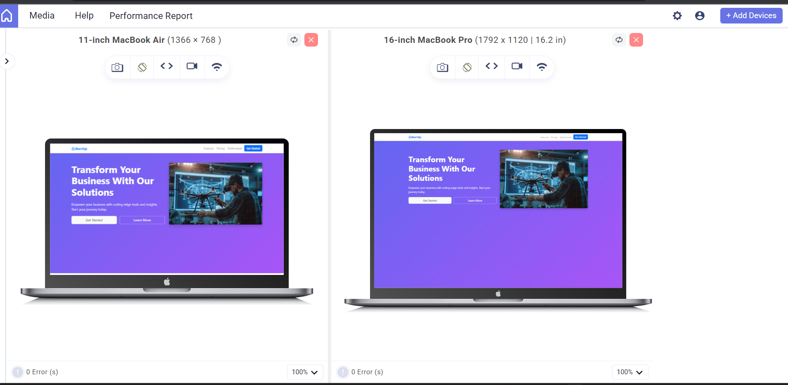

# Modern Landing Page

A responsive product landing page built using HTML, CSS, and Bootstrap, featuring a modern UI, mobile-first design, and clean layout structure for a seamless user experience across devices.

## Live Demo
https://modern-landing-page-sripad.netlify.app

## Features
- Responsive navigation bar
- Hero / banner section with call-to-action
- Features section highlighting product benefits
- About / information section
- Clean and structured footer
- Mobile-first and responsive design

## Tech Stack
- HTML5
- CSS3
- Bootstrap

## Screenshots

### Desktop View

### Mobile View

## Project Structure
modern-landing-page/
│── index.html  
│── css/  
│   └── style.css  
│── assets/  
│   ├── images/  
│   │   └── (project images used in the page)  
│   └── screenshots/  
│       ├── desktop.png  
│       └── mobile.png  

## Learning Outcomes
- Practiced responsive web design using Bootstrap
- Improved understanding of mobile-first layouts
- Strengthened frontend structure and UI design skills
